# ws_project2

## Deploying Machine Learning Model on Google Cloud Platform

### Introduction

The project is a web application that classifies images of skin moles using machine learning models.
Implemented a convolutional neural network which is applied for image analysis and processing.
This is fully connected neural network. The images are trained according to pixel values of the image and then classify them according to the label of the image.
The web application for the machine learning model accepts image input for skin moles and predicts skin mole in the image to be benign or malignant. 

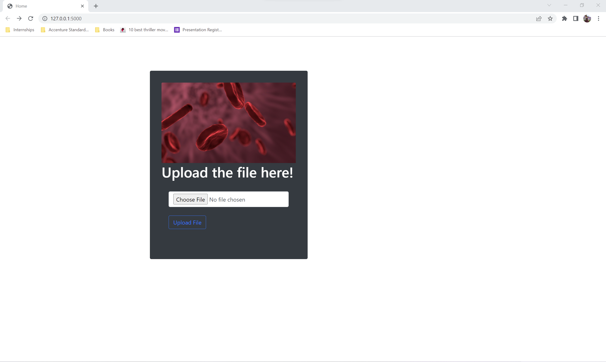

### Machine Learning Model
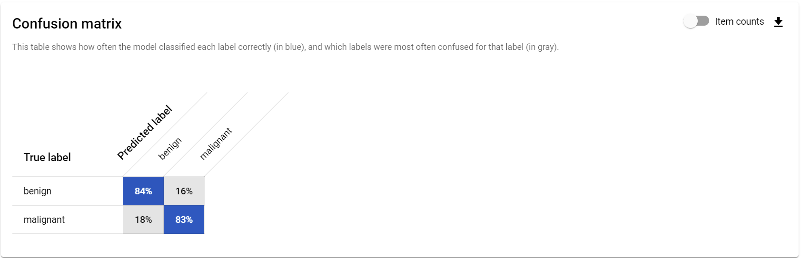

#### Sourced and Prepared the Dataset
For the dataset we used a set of images which contained a dataset of images of benign skin moles and malignant skin moles. 
There are two different sets of images for benign and malignant and each set contains around 1800 images of size (224x224). 
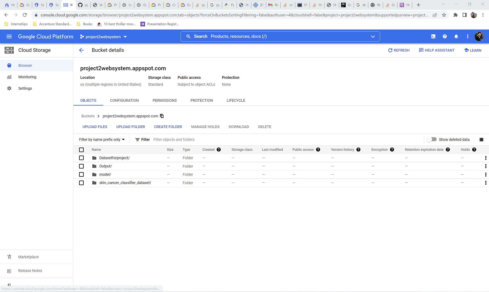

#### Trained Machine Learning Model
 Trained the model (approximately 80% of data will be used for training the model)
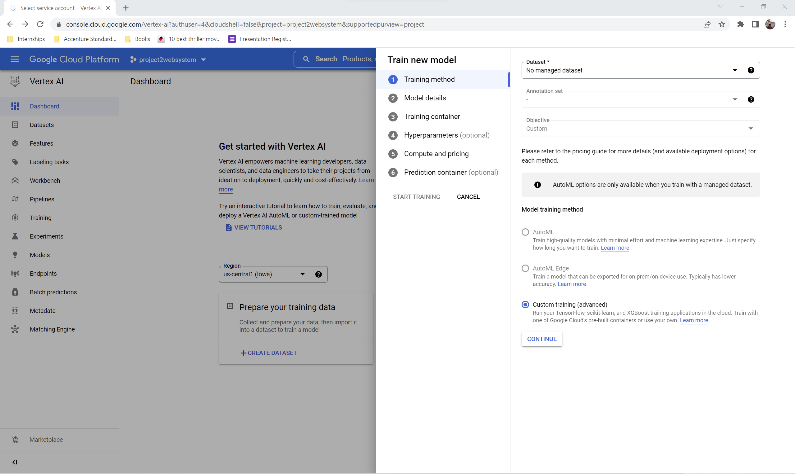

#### Tested Machine Learning Model
Evaluated model accuracy (approximately 20% of data will be used for validating the prediction)

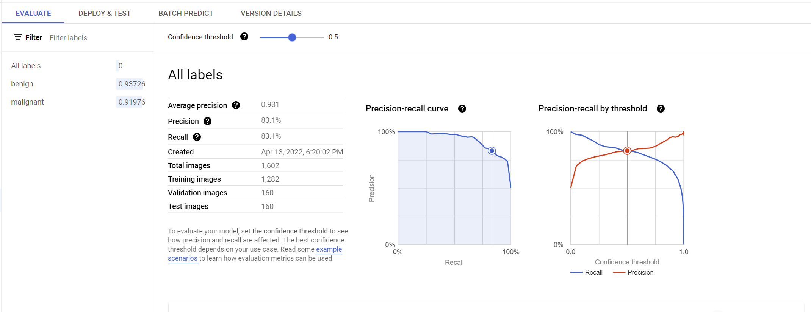

### Deployment Machine Learning Model

##### Create a Project on Google Cloud Platform
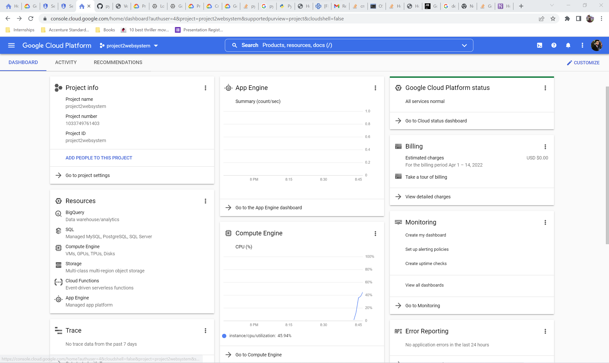
##### Access the console for the created application

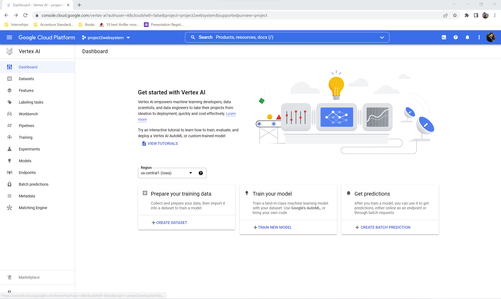

##### Upload the data to create the data set on google console
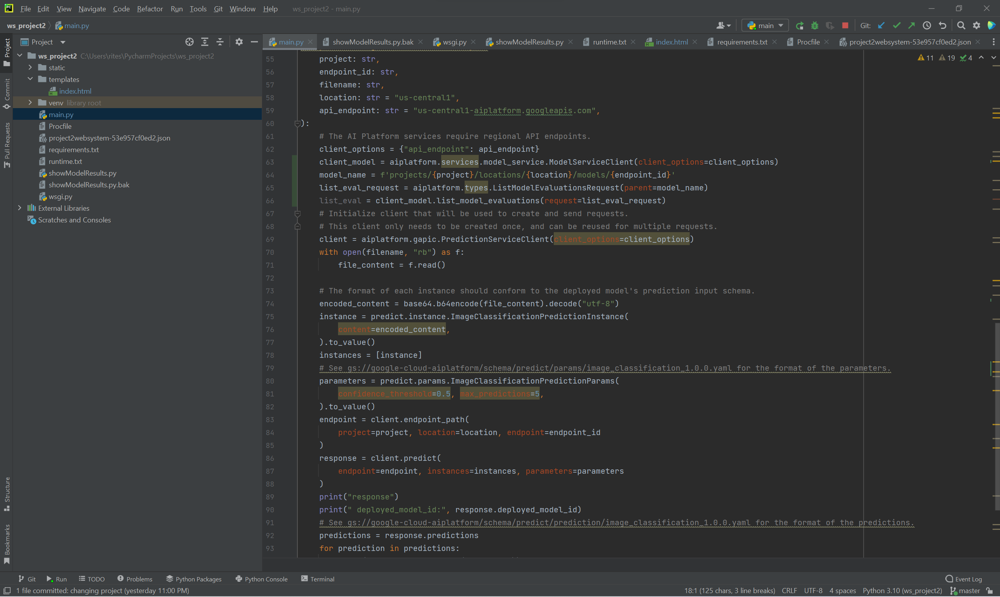
##### Train the model through the uploaded data set
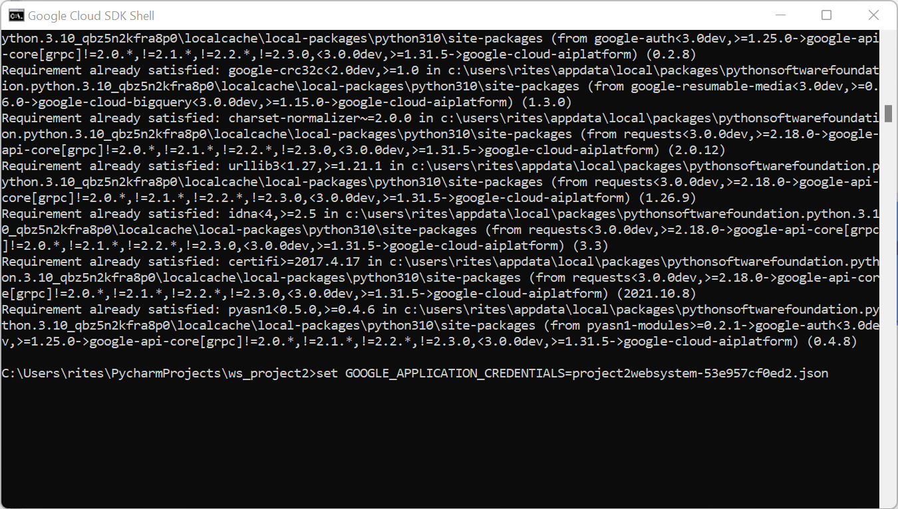
##### After training the model create an endpoint to access the model

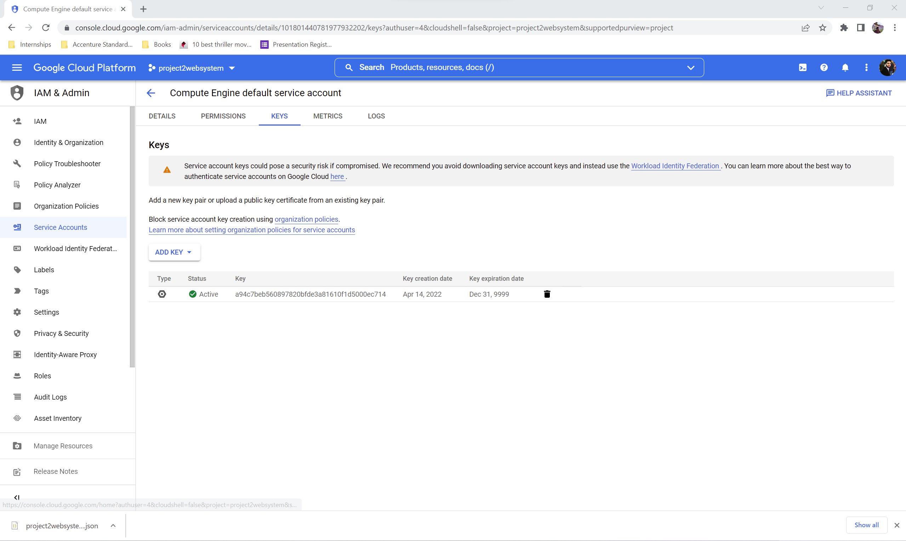

##### Install Google Cloud Packages for Python
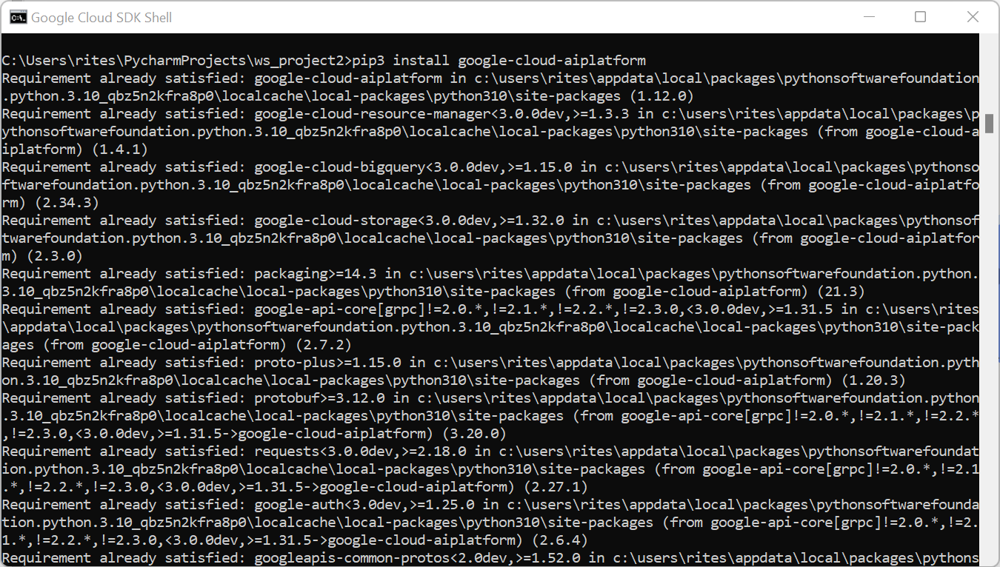

##### Create Service account and Download authentication keys

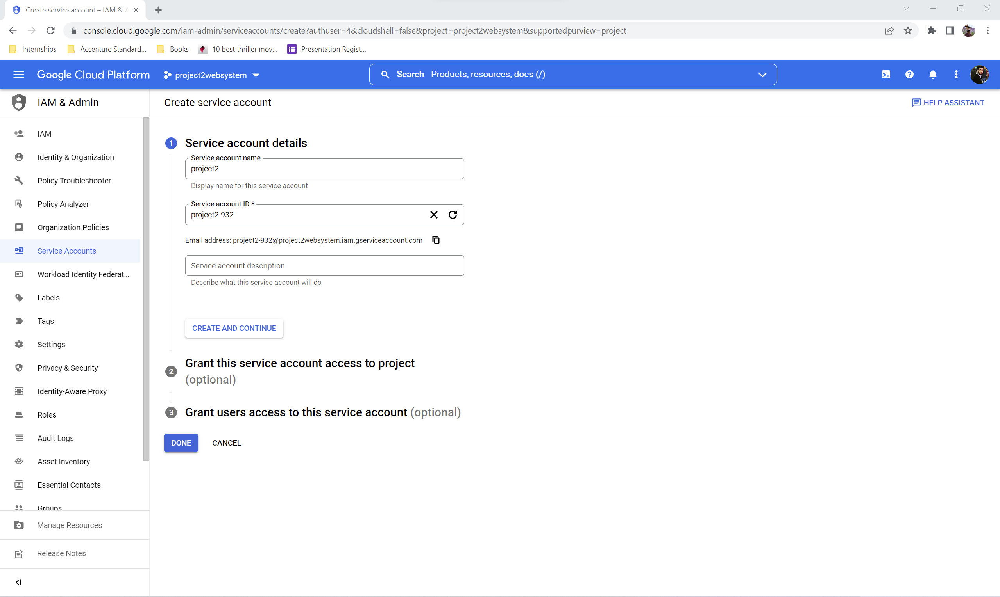
##### Set the authentication keys to access the model
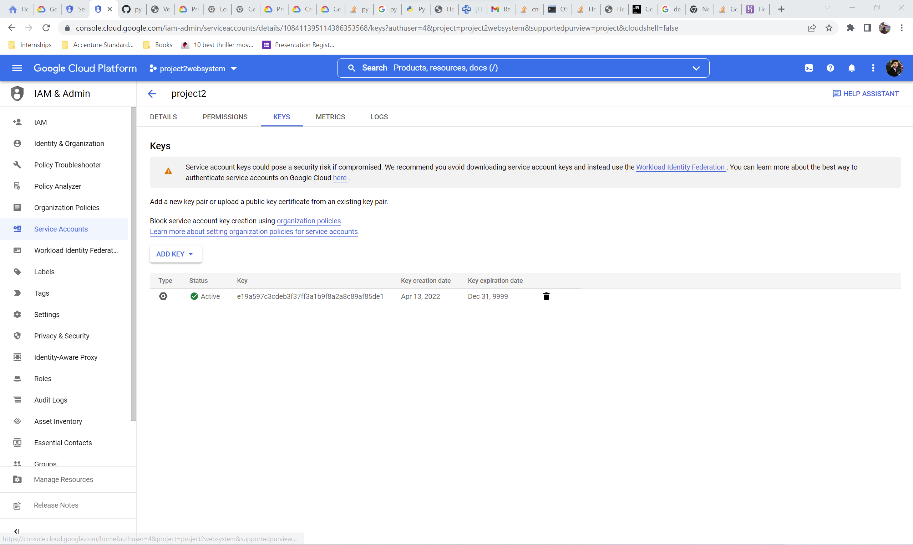
##### Run the application locally

