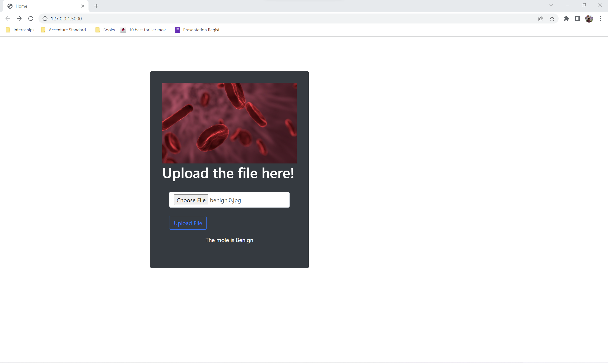

# ws_project2

## Deploying Machine Learning Model on Google Cloud Platform

Youtube: https://youtu.be/wjSxup3JQss

### Introduction

The project is a web application that classifies images of skin moles using machine learning models.
Implemented a convolutional neural network which is applied for image analysis and processing.
This is fully connected neural network. The images are trained according to pixel values of the image and then classify them according to the label of the image.
The web application for the machine learning model accepts image input for skin moles and predicts skin mole in the image to be benign or malignant. 

### Machine Learning Model On Google Cloud 
The Artificially Intelligent Platform includes tools for uploading your trained machine learning model to the cloud and sending prediction requests to the model. We will save our trained model using the tools supplied by our machine learning framework to deploy it on an Artificially Intelligent Platform. This entails converting the data that reflects our trained model into a file that we can use for cloud prediction. The saved model is then uploaded to a Cloud Storage bucket, and a model resource is created on Artificially Intelligent Platform with the Cloud Storage path to our saved model specified. We will also be including custom code when we deploy our model to alter how it handles prediction requests.

### Vertex AI
It brings together the Google Cloud services for building ML under one, unified UI and API. In Vertex AI, you can now easily train and compare models using AutoML or custom code training and all your models are stored in one central model repository. These models can now be deployed to the same endpoints on Vertex AI.

### Tensor Flow 
Tensor Flow is an open-source library (where we use the software to modify, publish, etc) generally considered for large-scale machine learning projects, including numerical computation. With its tools that have been developed, it supports developers in its best way. What makes Tensor flow different is that it involves multiple levels of abstractions, so you can choose the right one depending on your needs. We can build and train models by using high-level APIs which makes it much easier. Another vital feature includes better flexibility, eager execution allows for immediate iteration and debugging as well. Tensor has a standard way of representing data. It is used vastly in the leading companies to detect objects at a large scale to improve performance, improve speed and reliability, and detect complex fraud patterns.

### AutoML 
AutoML uses machine learning to analyze the content of image data. You can use AutoML to train an ML model to classify image data or find objects in image data.
A classification model analyzes image data and returns a list of content categories that apply to the image. For example, you could train a model that classifies images as containing a cat or not containing a cat, or you could train a model to classify images of dogs by breed.
An object detection model analyzes your image data and returns annotations for all objects found in an image, consisting of a label and bounding box location for each object. For example, you could train a model to find the location of the cats in image data.

### Machine Learning Model Confusion Matrix

### Create the project on google cloud platform

##### Upload the data to create the data set on google console

#### Sourced and Prepared the Dataset
For the dataset we used a set of images which contained a dataset of images of benign skin moles and malignant skin moles. 
There are two different sets of images for benign and malignant and each set contains around 1800 images of size (224x224). 

#### Trained Machine Learning Model
 Trained the model (approximately 80% of data will be used for training the model)

##### Train the model through the uploaded data set

#### Tested Machine Learning Model
Evaluated model accuracy (approximately 20% of data will be used for validating the prediction)

### Deployment Machine Learning Model

##### Create a Project on Google Cloud Platform

##### Access the console for the created application

##### After training the model create an endpoint to access the model

##### Install Google Cloud Packages for Python

##### Create Service account and Download authentication keys

##### Set the authentication keys to access the model

##### Run the application locally
